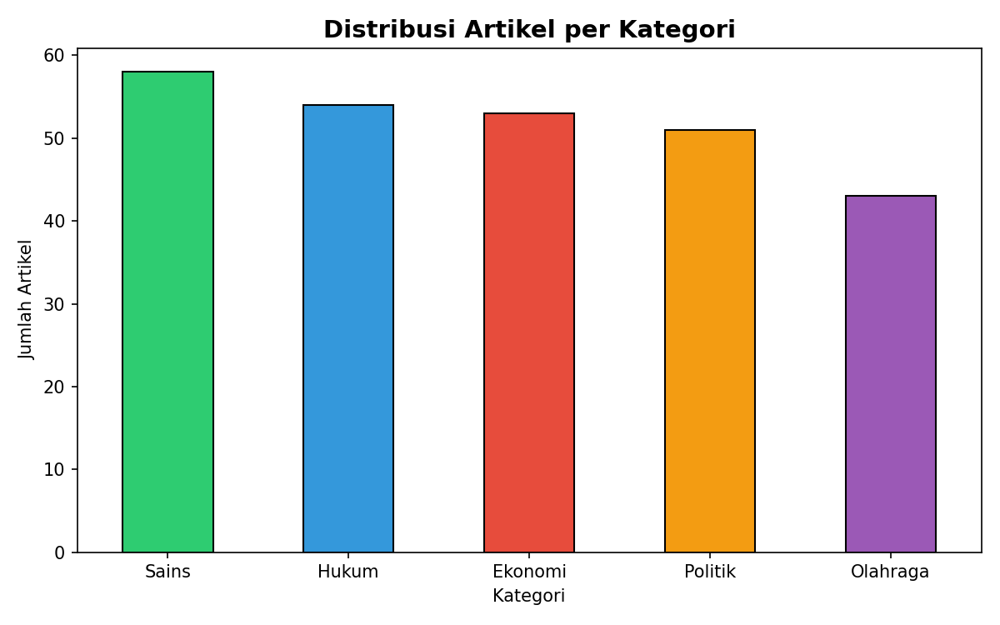
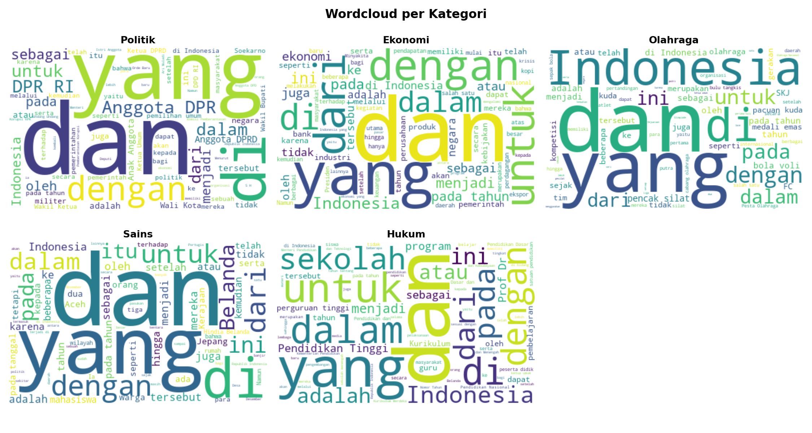
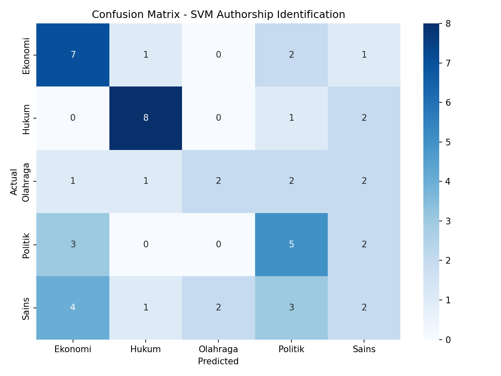

# 🔍 Authorship Identification pada Teks Bahasa Indonesia

Model machine learning untuk mengidentifikasi kategori/gaya penulisan teks Bahasa Indonesia berdasarkan stylometry, tanpa bergantung pada topik atau konten artikel.

---

## 🎯 Tujuan

Membangun model yang mampu menjawab: **"Dari kategori mana teks ini berasal?"** hanya dari pola bahasa seperti panjang kalimat, kosakata, dan kata fungsi yang digunakan.

**Use case nyata:**
- Forensik digital: identifikasi gaya penulisan dokumen anonim
- Deteksi plagiarisme terselubung
- Klasifikasi dokumen otomatis

---

## 📊 Dataset

- **Sumber:** Wikipedia Bahasa Indonesia (via API resmi)
- **Total artikel:** 259 artikel
- **Kelas:** 5 kategori (Politik, Ekonomi, Olahraga, Sains, Hukum)
- **Distribusi:** 43-58 artikel per kelas

---

## 🔬 Metode
Raw Text
↓
Preprocessing (cleaning, normalisasi)
↓
Feature Extraction
├── Stylometry klasik (avg kalimat, vocab richness, function words)
└── TF-IDF karakter n-gram (2-4 gram)
↓
SVM Classifier (kernel=linear)
↓
Output: Prediksi kategori + confidence score
---

## 📈 Hasil

| Metric | Score |
|---|---|
| Accuracy | 46% |
| Macro F1 | 0.44 |
| CV Accuracy | 37% ± 4% |

> Catatan: Accuracy yang relatif rendah wajar karena semua teks berasal dari Wikipedia yang gaya bahasanya seragam antar kategori. Ini justru membuktikan bahwa model berhasil menangkap pola subtle dari gaya penulisan.

---

## 📁 Struktur Project
authorship-identification-id/
├── data/
│   ├── raw/                  # Data mentah hasil scraping
│   └── processed/            # Data siap modeling
├── notebooks/
│   └── 02_eda.ipynb          # Exploratory Data Analysis
├── src/
│   ├── scraper.py            # Scraping Wikipedia via API
│   ├── preprocessor.py       # Cleaning + ekstraksi fitur
│   └── model.py              # Training & evaluasi SVM
├── results/                  # Confusion matrix & visualisasi
└── requirements.txt
---

## 🛠️ Cara Menjalankan

```bash
# 1. Clone repo
git clone https://github.com/cacastudymarket/authorship-identification-id
cd authorship-identification-id

# 2. Install dependencies
pip install -r requirements.txt

# 3. Scraping data
python src/scraper.py

# 4. Preprocessing
python src/preprocessor.py

# 5. Training model
python src/model.py
```

---

## 📊 Visualisasi

### Distribusi Artikel per Kategori


### Wordcloud per Kategori


### Confusion Matrix


---

## 🛠️ Tech Stack

- Python 3.12
- scikit-learn (SVM, TF-IDF)
- Wikipedia API
- pandas, matplotlib, seaborn, wordcloud